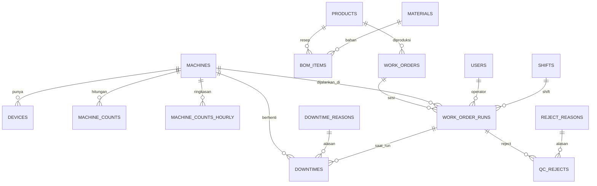

# ERD

```mermaid
erDiagram
  MACHINES ||--o{ DEVICES : punya
  MACHINES ||--o{ MACHINE_COUNTS : hitungan
  MACHINES ||--o{ MACHINE_COUNTS_HOURLY : ringkasan
  PRODUCTS ||--o{ BOM_ITEMS : resep
  MATERIALS ||--o{ BOM_ITEMS : bahan
  PRODUCTS ||--o{ WORK_ORDERS : diproduksi
  WORK_ORDERS ||--o{ WORK_ORDER_RUNS : sesi
  MACHINES ||--o{ WORK_ORDER_RUNS : dijalankan_di
  USERS ||--o{ WORK_ORDER_RUNS : operator
  SHIFTS ||--o{ WORK_ORDER_RUNS : shift
  WORK_ORDER_RUNS ||--o{ QC_REJECTS : reject
  REJECT_REASONS ||--o{ QC_REJECTS : alasan
  MACHINES ||--o{ DOWNTIMES : berhenti
  DOWNTIME_REASONS ||--o{ DOWNTIMES : alasan
  WORK_ORDER_RUNS ||--o{ DOWNTIMES : saat_run
```
Kinerja operator dihitung dari `work_order_runs.operator_id` (tidak ada tabel terpisah).
Indeks unik parsial: 1 run terbuka per mesin, 1 run terbuka per WO, 1 downtime terbuka per mesin.
